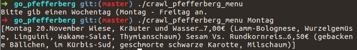

# go_pfefferberg
crawl the Menu for the daily dish of Berlin's Pfefferberg Restaurant by passing the weekday.

> go build crawl_pfefferberg_menu.go

> ./crawl_pfefferberg_menu Montag
```
[Montag 20.November Wiese, Kräuter und Wasser…7,00€ (Lamm-Bolognese, Wurzelgemüse, Linguini, Wakame-Salat, Thymianschaum) Sesam Vs. Rundkornreis…6,50€ (gebackene Bällchen, im Kürbis-Sud, geschmorte schwarze Karotte, Milschaum)]
```

